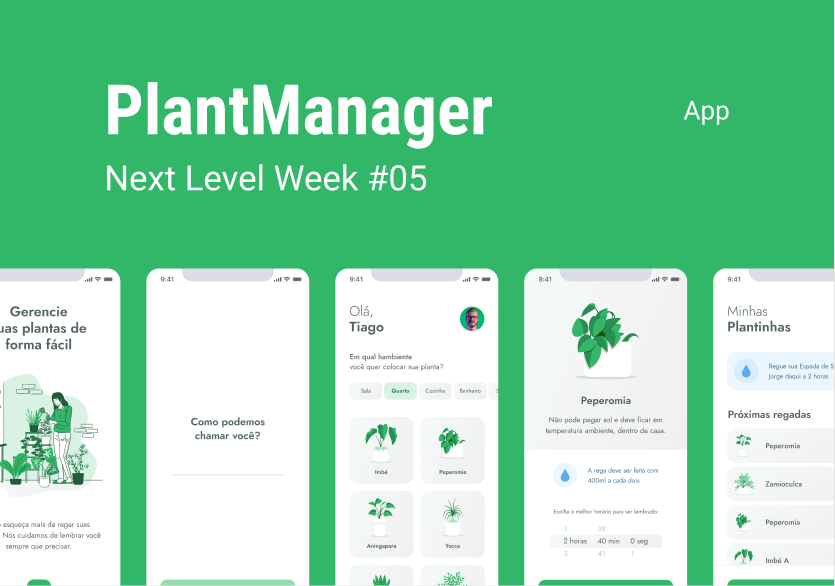

<div align="center">
    <h1 align="center">PlantManager</h1>
    <p>Aplicação de gerenciamento de plantas mobile, desenvolvida durante a NLW#5.</p>
    
</div>

## Índice

* [Descrição](#descrição)
* [Features](#features) 
* [Techs](#techs)
  * [Libs](#Libs)
* [Design](#design)
  * [Cores](#cores)
  * [Tipo de fonte](#tipo-de-fonte)
  * [Pacote de ícones](#pacote-de-ícones)
* [Instalação](#instalação)
* [Links Contato](#links-contato)
* [Licença](#licença)

# Descrição
Aplicação de gerenciamento de plantas mobile, desenvolvida durante a **NLW#5** realizada pela [**@Rocketseat**](https://github.com/Rocketseat)

## Features:
- [x] UI/UX Design
- [x] Cadastro de usuário
- [x] Validação de usuário
- [x] Cadastro de plantas
- [x] Salvamento local
- [x] Dicas de cuidado por planta
- [x] Agendamento de cuidados por horário
- [x] Listagem de plantas salvas
- [x] Notificações para cuidado das plantas
- [x] Requisições e respotas de API

# Techs: 
- **JavaScript**
- **TypeScript**
- **React Native**
- **Expo**

## Libs:
- **axios**
- **JSON-Server**
- **date-fns**
- **React Navigation**
- **Expo Fonts**
- **Expo Vector Icons**
- **Expo LottieFiles**
- **Expo DateTimePicker**
- **Expo AsyncStorage**
- **Expo Notifications**

# Design:
- O modelo final para mobile está disponível na pasta `./design`<br>
- Imagens disponíveis na pasta `./assets` e `./src/assets`<br>

## Cores:
- Green: #32B768<br>
- Green-Dark: #2B7A4B<br>
- Green-Light: #DAF2E4<br>
- Heading: #52665A<br>
- Body-Dark: #738078<br>
- Body-Light: #AAB2AD<br>
- Background: #FFFFFF<br>
- Shape: #F0F0F0<br>
- White: #FFFFFF<br>
- Gray: #CFCFCF<br>
- Blue: #3D7199<br>
- Blue-Light: #EBF6FF<br>
- Red: #E83F5B<br>

## Tipo de fonte:
- **Jost:** 600Semi-bold, Regular 400

## Pacote de ícones:
- **Feather**

# Instalação:

```bash
  # Abra o terminal e instale o expo-cli:
  $ npm install --global expo-cli

  # Clone este repositório:
  $ git clone https://github.com/CleilsonAndrade/plantmanager.git
  $ cd ./plantmanager

  # Instale as dependências, inicie o servidor da API e inicie o servidor de desenvolvimento:
  $ npm install
  $ json-server ./src/services/server.json --host 192.168.1.8 --port 3333 -d 700
  $ expo start
```

# Links Contato
- **Linkedin**: https://www.linkedin.com/in/cleilson-andrade/<br>
- **GitHub**: https://github.com/CleilsonAndrade<br>

# Licença
<p align="center"><a href="https://github.com/CleilsonAndrade/plantmanager/blob/master/LICENSE"></a></p>
